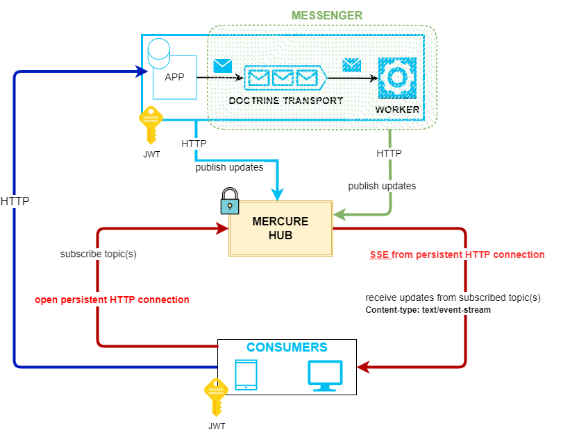
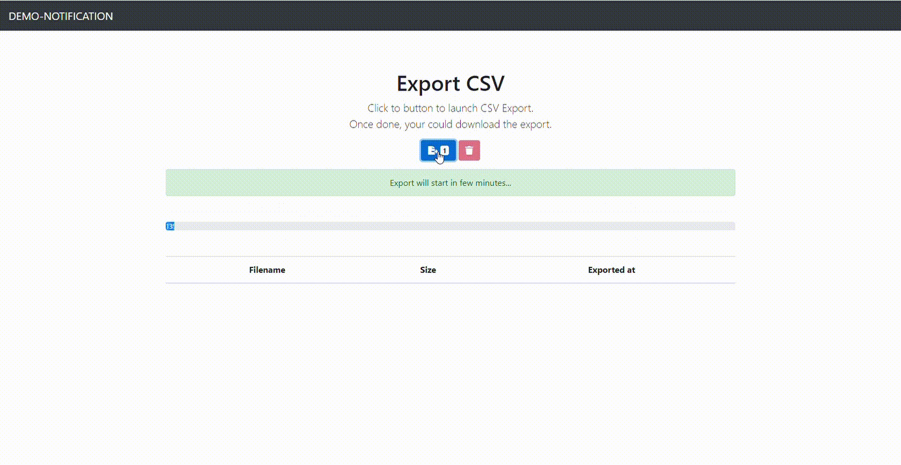
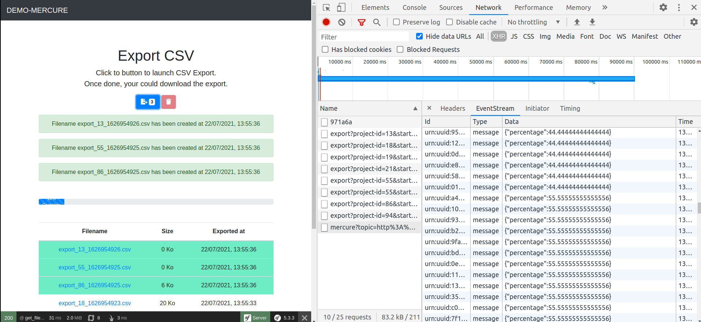

# Asynchronous export with real-time notifications
> Demo made with mercure and messenger symfony components

Extract csv data in asynchronous way using messenger and and get real-time notifications about what happened using mercure components




## Installation

```bash
cp .env.dist .env
make build
```

Export CSV             |  Notification center
:-------------------------:|:-------------------------:
  |  


Login: [localhost:8080](http://localhost:8080)

Notification: [http://localhost:8080/app/notifications](http://localhost:8080/app/notifications)

### Credentials
  * Login: `demo-1`, Password: `demo-1`
  * Login: `demo-2`, Password: `demo-2`
  * Login: `admin`, Password: `admin`

### Command
> Send a notification with random message with option if you want to push more messages

```bash
docker exec -it poc-php-fpm bin/console app:send-notif -i 50
```

### Debugging
* Debugging tool: http://localhost:9000/.well-known/mercure/ui/
* Upload postman collection [postman/](postman/)  

## Usage

|Commands |Description  |
|---------|-------------|
|make build| Installation |
|make run| Start containers |
|make shutdown| Shutdown containers |
|make restart| Restart containers |
|make php-fpm| Connect php-fpm container |
|make php-worker| Connect php-worker container  |
|make mysql| Connect mysql container |
|make mercure| Connect mercure container |
|make composer| Install composer dependencies |
|make npm install| Install npm dependencies |
|make npm build| Build npm dependencies |
|make rebuild-database| Rebuild database |
|make test| Execute phpunit tests |
|make coverage| Execute phpunit tests |
|make help | Show list of commande available


## Links
* [Pushing Data to Clients Using the Mercure Protocol](https://symfony.com/doc/current/mercure.html)
* [Messenger: Sync & Queued Message Handling](https://symfony.com/doc/current/messenger.html)
* [Getting started with mercure](https://mercure.rocks/docs/getting-started)
* [Mercure documentation](https://mercure.rocks/docs)
* [Awesome Mercure Resources](https://mercure.rocks/docs/ecosystem/awesome)
* [Using server-sent events](https://developer.mozilla.org/en-US/docs/Web/API/Server-sent_events/Using_server-sent_events)
