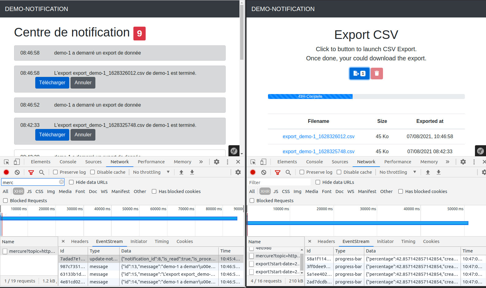

# Demo Mercure

Extract large data in asynchronous way using Messenger and Mercure for live notification




## Configuration

### env variables
```bash
cp .env.dist .env
```

## Installation

### Build the app
```bash
make build
```

## Link

Notification page: http://localhost:8080/app/notifications

## Command

Send a notification with random message with option if you want to push more messages

Send 50 notifications
```bash
docker exec -it poc-php-fpm bin/console app:send-notif -i 50
```

## Debugging

Debugging tool: http://localhost:9000/.well-known/mercure/ui/

Upload postman collection [postman/](postman/)